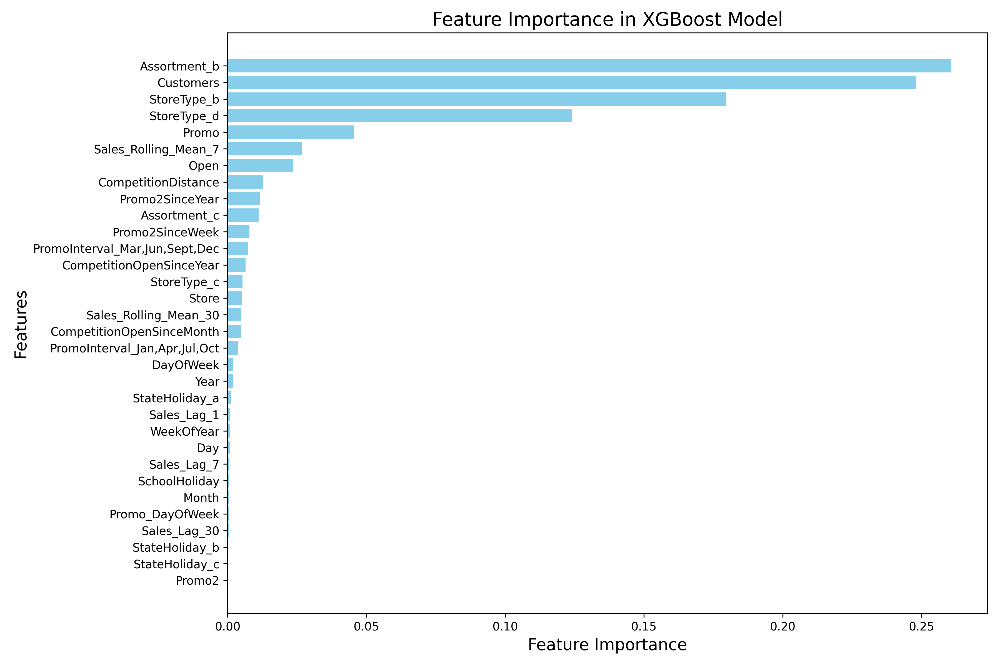
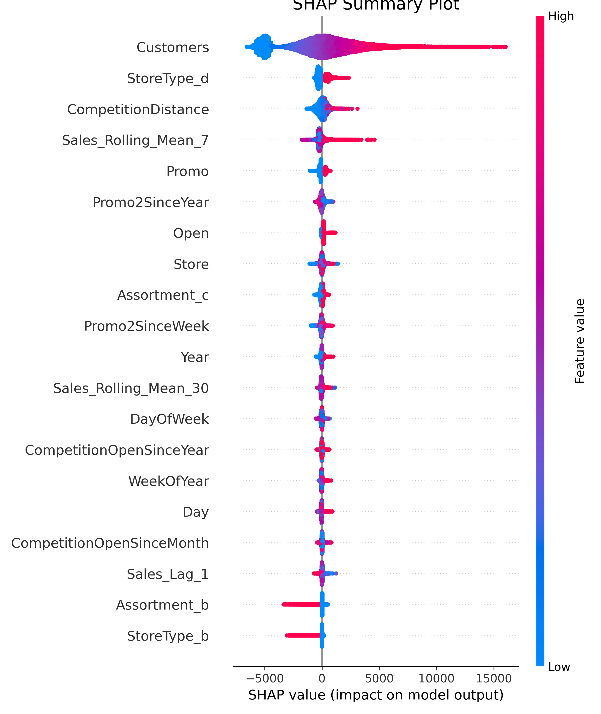

# Sales Forecasting Project

Welcome to the **Sales Forecasting Project**, an end-to-end implementation of a machine learning pipeline designed to predict daily sales for retail stores. This project showcases data preprocessing, feature engineering, model training, hyperparameter tuning, and model evaluation with advanced visualizations.

---

## Table of Contents
1. [Project Overview](#project-overview)
2. [Dataset Description](#dataset-description)
3. [Project Workflow](#project-workflow)
4. [Requirements](#requirements)
5. [Setup and Installation](#setup-and-installation)
6. [Usage](#usage)
7. [Results](#results)
8. [File Structure](#file-structure)
9. [Contributing](#contributing)
10. [License](#license)

---

## Project Overview

This project aims to develop a **Sales Forecasting Model** for retail stores using **XGBoost** regression. The pipeline covers:
- **Data Preprocessing**: Cleaning and transforming raw data for better feature representation.
- **Feature Engineering**: Enhancing the dataset with meaningful features.
- **Model Training and Tuning**: Hyperparameter tuning using grid search and XGBoost's built-in cross-validation.
- **Evaluation**: Model evaluation using metrics such as RMSE and MAE.
- **Visual Insights**: SHAP visualizations and feature importance to interpret the model's predictions.

---

## Dataset Description

The dataset contains daily sales data for retail stores, including features such as:
- **Store Information**: Store type, promotions, etc.
- **Date**: Daily sales and customer information.
- **Holidays**: School holidays and state holidays.

The raw dataset is located in the `data/raw` folder.

---

## Project Workflow

1. **Exploratory Data Analysis (EDA)**:
   - Conducted in the `notebooks/eda.ipynb` notebook.
   - Gained insights into trends, seasonality, and feature distributions.

2. **Data Preprocessing**:
   - Cleaned and transformed raw data.
   - Encoded categorical variables.

3. **Feature Engineering**:
   - Enhanced data with engineered features like year, month, week, and holidays.

4. **Model Training and Tuning**:
   - Trained a baseline model for comparison.
   - Used XGBoost for hyperparameter tuning.

5. **Model Evaluation**:
   - Evaluated the final model using RMSE and MAE.
   - Visualized SHAP summary plots and feature importance.

---

## Requirements

- Python 3.10 or higher
- Required libraries are listed in `requirements.txt`. Install them using:
  ```bash
  pip install -r requirements.txt


## Setup and Installation

1. **Clone the Repository**:
   ```bash
   git clone https://github.com/DataStatsMohith/Sales-Forecasting.git
   cd Sales-Forecasting
   ```

2. **Set Up Virtual Environment**:
   ```bash
   python -m venv sales_forecasting_env
   source sales_forecasting_env/bin/activate  # Mac/Linux
   sales_forecasting_env\Scripts\activate    # Windows
   ```

3. **Install Dependencies**:
   ```bash
   pip install -r requirements.txt
   ```

4. **Run the Project**:
   - Preprocess data:
     ```bash
     python scripts/preprocess_data.py
     ```
   - Engineer features:
     ```bash
     python scripts/feature_engineering.py
     ```
   - Train and tune the model:
     ```bash
     python scripts/xgboost_tuning.py
     ```

---

## Usage

- **Run Scripts**:
  Use the provided Python scripts in the `scripts` folder to preprocess data, train models, and generate predictions.

- **EDA Notebook**:
  Explore insights in `notebooks/eda.ipynb`.

---

## Results

- **Final Model**:
  - RMSE: 400.96
  - MAE: 245.70

- **Feature Importance**:
  

- **SHAP Analysis**:
  

---

## File Structure

```
Sales-Forecasting/
│
├── data/
│   ├── raw/                    # Raw dataset
│   ├── processed/              # Processed and engineered data
│   ├── X_train.csv             # Training features
│   ├── X_val.csv               # Validation features
│   ├── y_train.csv             # Training target
│   ├── y_val.csv               # Validation target
│
├── notebooks/
│   ├── eda.ipynb               # Exploratory Data Analysis notebook
│
├── plots/                      # Visualizations
│   ├── feature_importance.png
│   ├── shap_summary_plot.png
│   ├── shap_force_plot.html
│
├── scripts/                    # Python scripts for the project
│   ├── preprocess_data.py
│   ├── feature_engineering.py
│   ├── model_preparation.py
│   ├── xgboost_tuning.py
│   ├── utils.py
│
├── models/                     # Trained models
│   ├── final_xgb_model.pkl
│
├── requirements.txt            # Project dependencies
├── README.md                   # Project documentation
```

---

## Contributing

Contributions are welcome! Feel free to fork this repository and submit a pull request with your changes.

---

## License

This project is licensed under the MIT License - see the [LICENSE](LICENSE) file for details.

